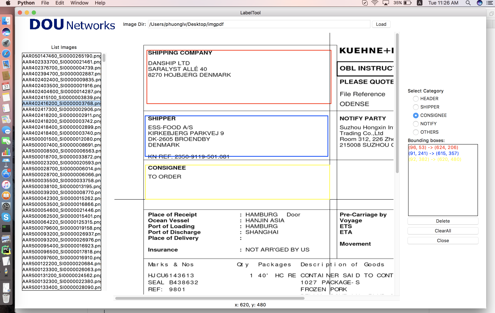

# LabelTool for Linux- Mac OS
Label-Tool
===============

A simple tool for labeling object bounding boxes in images, implemented with Python Tkinter.

**Updates:**
- 2017.10.30 implemented by phuong.le@dounets.com

**Screenshot:**

Data Organization
-----------------
LabelTool  
|  
|--main.py   *# source code for the tool*  
|  
|--Images/   *# direcotry containing the images to be logo*  
|  
|--Utility/   *# direcotry for some utility funcs*  
|  
|--Congig/  *# direcotry for the config of program*  

Environment
----------
- python 3.6
- python PIL (Pillow) 
- tesseract
- glob

Run
-------
$ python3 main.py

Usage
-----
1. The current tool requires that **the images to be labeled reside in folder whose path in config files. You will need to modify the code if you want to label images elsewhere**.
2. click `Load`button to select input folder. The images in the folder will be loaded.
3 .Select Category which need label( Shipper, consignee,notify,vessel..)
4. To create a new bounding box, left-click to select the first vertex. Moving the mouse to draw a rectangle, and left-click again to select the second vertex.
  - To cancel the bounding box while drawing, just press `<Esc>`.
  - To delete a existing bounding box, select it from the listbox, and click `Delete`.
  - To delete all existing bounding boxes in the image, simply click `ClearAll`.
  - Check the the result from the path which was config in setp 1
5. After finishing one image, click others image in the left list box to advance and repeat step 1
  - Be sure to click `Next` after finishing a image, or the result won't be saved. 

Note:
-----
This program for linux, mac 
With window: -need update folder path in the configuration
             - Specify the location of tessdata path replace "/usr/local/share" with path on the window "C:\Program Files (x86)\Tesseract-OCR\tessdata" in the flowing code:
                "subprocess.run(
                "tesseract --tessdata-dir /usr/local/share " + input_file + " " + outputfile + " -l eng -psm 7 tsv", shell=True,
                stdout=DEVNULL, universal_newlines=True)
